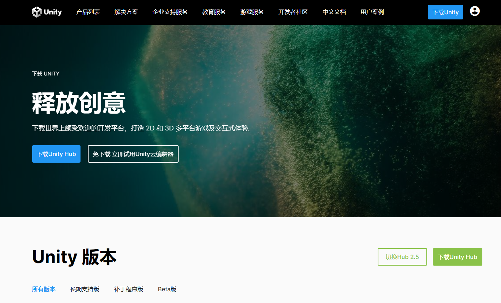
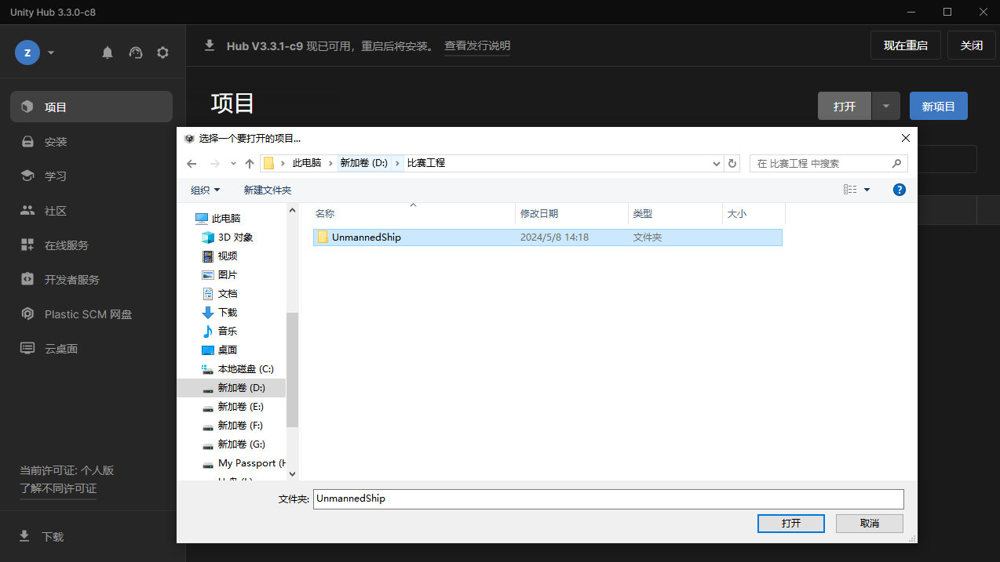
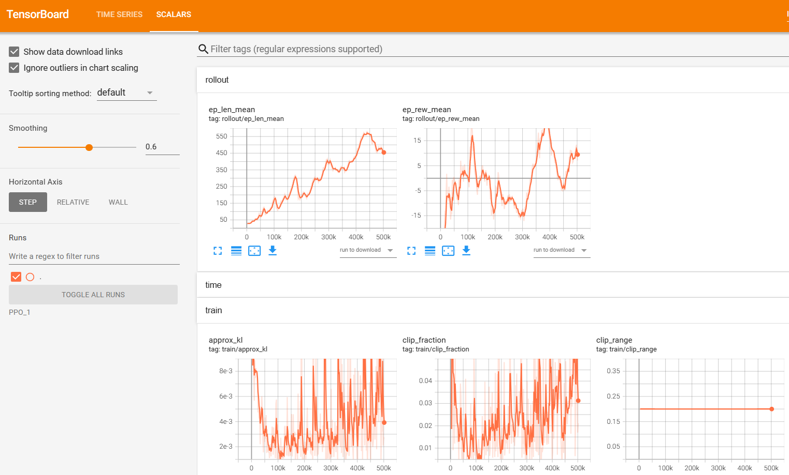
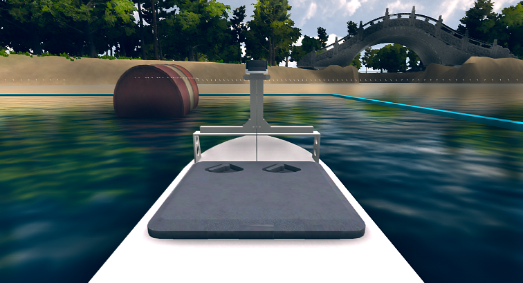
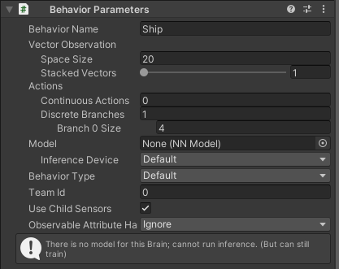
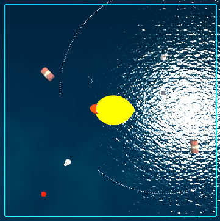
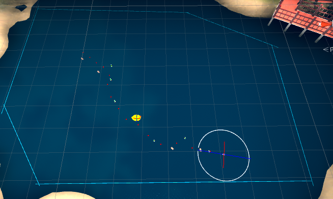

# 平台使用文档

## 1. Unity3D环境搭建

### 1.1 下载UnityHub

+ 官网链接：https://unity.cn/releases



+ 注册账号并登录


+ 申请个人许可证（许可证到期后可免费延期）



### 1.2 下载Unity

+ 从官网中找到版本为2020.3.10f1c1的Unity，选择从Hub下载

### 1.3 加载工程

## 2. Anaconda环境搭建

### 2.1 下载并安装Anaconda

### 2.2 创建虚拟环境

+ 打开命令行窗口


+ 新建虚拟环境，命令为

```
conda create -n match python=3.8
```

+ 输入上述命令后按回车键，出现如下画面


+ 按y键进行安装
+ 安装完成后，可通过`conda env list`命令查看已有的环境
+ 通过`conda activate 环境名`激活创建的环境

```
conda activate match
```

+ 通过`pip list`命令可查看当前环境已安装package

### 2.3 安装Pytorch

+ 官网链接：https://pytorch.org/

+ 如果电脑没有GPU，则安装CPU版本的Pytorch
+ 如果电脑有GPU，可通过`nvidia-smi`命令查看支持的cuda版本，安装对应的Pytorch

```
pip install torch==2.0.1 torchvision==0.15.2 torchaudio==2.0.2 --index-url https://download.pytorch.org/whl/cu118
```

### 2.4 安装ML-Agents包

```
pip install mlagents==0.30.0
```

### 2.5 安装stable-baselines3

```
pip install stable-baselines3==2.1.0
```

### 2.6 调整其余包版本

若运行python脚本时提示某个package版本过高或过低，可手动安装符合要求的版本

```
pip install 包名==包版本
```

### 2.7 参考环境配置

```
Package                    Version
-------------------------- ------------
absl-py                 2.1.0
attrs                   23.2.0
cachetools              5.3.3
cattrs                  1.5.0
certifi                 2022.12.7
charset-normalizer      2.1.1
cloudpickle             3.0.0
contourpy               1.1.1
cycler                  0.12.1
Farama-Notifications    0.0.4
filelock                3.9.0
fonttools               4.51.0
google-auth             2.29.0
google-auth-oauthlib    1.0.0
grpcio                  1.62.1
gym                     0.26.2
gym-notices             0.0.8
gymnasium               0.29.1
h5py                    3.11.0
idna                    3.4
importlib_metadata      7.1.0
importlib_resources     6.4.0
Jinja2                  3.1.2
kiwisolver              1.4.5
Markdown                3.6
MarkupSafe              2.1.3
matplotlib              3.7.5
mlagents                0.30.0
mlagents-envs           0.30.0
mpmath                  1.3.0
networkx                3.0
numpy                   1.21.2
oauthlib                3.2.2
packaging               24.0
pandas                  2.0.3
PettingZoo              1.15.0
pillow                  10.2.0
pip                     23.3.1
protobuf                3.20.2
pyasn1                  0.6.0
pyasn1_modules          0.4.0
pyparsing               3.1.2
pypiwin32               223
python-dateutil         2.9.0.post0
pytz                    2024.1
pywin32                 306
PyYAML                  6.0.1
requests                2.28.1
requests-oauthlib       2.0.0
rsa                     4.9
setuptools              68.2.2
Shimmy                  1.1.0
six                     1.16.0
stable-baselines3       2.1.0
sympy                   1.12
tensorboard             2.14.0
tensorboard-data-server 0.7.2
torch                   2.0.1+cu118
torchaudio              2.0.2+cu118
torchvision             0.15.2+cu118
typing_extensions       4.8.0
tzdata                  2024.1
urllib3                 1.26.13
Werkzeug                3.0.2
wheel                   0.41.2
zipp                    3.18.1
```

## 3. 开始运行

+ 确保已成功配置Unity工程和python虚拟环境

### 3.1 手动控制

+ 单击编辑器上方的运行按钮
+ 使用键盘控制无人艇运动
  + W 前进
  + A 左转
  + D 右转

### 3.2 强化学习训练

+ 使用Pycharm或VScode等编辑器创建python脚本
+ 粘贴下列代码

```python
from mlagents_envs.environment import UnityEnvironment as UE
from mlagents_envs.envs.unity_gym_env import UnityToGymWrapper
from stable_baselines3 import PPO

UniytEnv = UE()
env = UnityToGymWrapper(UniytEnv,flatten_branched=True, allow_multiple_obs=False)

model = PPO(
    'MlpPolicy',
    env=env,
    batch_size=64,
    gamma=0.999,
    gae_lambda=0.98,
    verbose=1,
    device="cuda",
    tensorboard_log="./tb_logs/usv/",
)

model.learn(
    total_timesteps=500000,
)

model.save("ppo_navigation_policy")

```

+ 选择第2节创建的虚拟环境运行脚本
+ 单击unity编辑器的运行按钮，开始训练

### 3.3 使用tenserboard查看训练效果

+ 打开命令行窗口，激活第2节创建的虚拟环境
+ 进入训练日志的生成目录，如“./tb_logs/usv/”
+ 输入下列命令

```
tensorboard --logdir 文件夹名(如PPO_1)
```

+ 浏览器打开网址，默认为http://localhost:6006/



### 3.4 加载训练模型

+ 使用Pycharm或VScode等编辑器创建python脚本
+ 粘贴下列代码

```python
from mlagents_envs.environment import UnityEnvironment as UE
from mlagents_envs.envs.unity_gym_env import UnityToGymWrapper
from stable_baselines3 import PPO

UniytEnv = UE()
env = UnityToGymWrapper(UniytEnv,flatten_branched=True, allow_multiple_obs=False)

model = PPO.load("ppo_navigation_policy", env=env)
obs = env.reset()
while True:
    action, _states = model.predict(obs)
    obs, rewards, dones, info = env.step(action)
    if dones:
        obs = env.reset()
```

+ 选择第2节创建的虚拟环境运行脚本
+ 单击unity编辑器的运行按钮，查看训练效果

### 3.5 切换场景

**注意：训练场景同一时刻只能开启一个，否则无法打包训练环境**

以区域赛训练场景切换至国赛训练场景为例：

+ 选中Hierarchy中的regional_train_scenario，将Inspector窗口中的对勾取消


+ 选中Hierarchy中的national_train_scenario，将Inspector窗口中的对勾勾选


## 4. 工程详解

### 4.1 基础知识

+ **强化学习**

强化学习是机器学习的一个重要分支。它研究的问题是智能体在未知的环境中，如何优化自身的决策、采取最优行为来极大化奖励的期望值。


强化学习将世界分为两部分，智能体(Agent)和环境(Environment)。智能体从环境中感知到当前时刻的状态$S_t$和奖励$R_t$，之后根据感知信息进行决策并采取动作$A_t$，动作被执行后影响环境进入下一个状态。智能体继续获得下一时刻的状态$S_{t+1}$和奖励$R_{t+1}$。智能体的目的是获得的奖励尽可能多。

+ **马尔可夫决策过程**

马尔可夫决策过程可以用五元组表示$<S,A,P,R,\gamma>$，其中，$S$为状态集合，$A$为动作集合，$P$为状态转移概率，$R$为奖励函数，$\gamma$为折扣因子。

+ **ML-Agents**

ML-Agents是Unity提供的用于强化学习训练的功能包。借助该功能包，可以将自定义的Unity环境建模为马尔可夫决策过程，然后使用Gym Wrapper转化为强化学习训练环境，进而通过与Python的通信实现神经网络的训练。详细介绍可查看官方文档：https://github.com/Unity-Technologies/ml-agents

**本工程基于ML-Agents框架，搭建了Unity水域场景，定义了马尔可夫决策过程，并将场景包装为Gym式训练环境**


### 4.2 Unity场景

#### 4.2.1 区域赛训练场景

如下图所示，区域赛训练场景为10m*10m大小的方形区域，对应Hierarchy窗口中“regional_train_scenario”





场景包含：

+ 无人艇(USV100)
+ 四周的墙体(Walls)
+ 障碍物(Obstacles)
+ 目标点(Target)

#### 4.2.2 无人艇(智能体)

无人艇上搭载了强化学习训练必要的脚本控件和激光雷达传感器

+ Behavior Parameters
  + `Behavior Name`：行为名称
  + `Vector Observation->Space Size`：向量观测大小，与训练脚本中状态空间设置有关(见4.2.3 收集观测函数，1+1+1+18=21)；二者不一致，编译器会给出警告
  + `Actions->Continuous Actions`：连续动作空间数量；本工程使用离散动作空间，因此为0
  + `Actions->Discrete Branch`：1个离散动作空间，大小为4，对应4.2.3 控制函数



+ Regional_Train：训练脚本
  + `Max Step`：回合最大步数
  + `Target`：目标点


+ Decision Requester
  + `Decision Period`：智能体探索多少步后接收一次决策


+ 激光雷达：USV100搭载了一个单线激光雷达，测距范围为0-15m，水平视场角为360°，角分辨率为1°，可用于感知周围环境。具体使用方法见 4.2.3 收集观测函数

#### 4.2.3 区域赛训练脚本

基于ML-Agents提供的Agent基类实现，对应Project窗口中Assets/Scripts/Regional_Train，已挂载到场景中的智能体(USV100)上

下面给出详细解释

+ 初始化函数：训练开始时执行，用于初始化操作

```c#
public override void Initialize()
{
    rBody = GetComponent<Rigidbody>(); //获取刚体控件
    Lidar = GetComponentInChildren<VelodyneSensor>();	//获取激光雷达控件
    MaxRew = 100;	//设置最大奖励值
}
```

+ 回合起始函数：每个回合开启时执行，用于回合的初始化

```c#
public override void OnEpisodeBegin()
{
    rBody.velocity = Vector3.zero;  //无人艇速度置0
    transform.localPosition = new Vector3(GetRandomPos().x, 0.5f, GetRandomPos().z); //随机设置无人艇位置
    Target.transform.localPosition = GetRandomPos(); //随机设置目标点位置
    transform.localRotation = Quaternion.Euler(new Vector3(0.0f, 0.0f, 0.0f)); //设置无人艇朝向
}
```

+ 收集观测函数：以向量观测的形式，定义状态空间；状态空间大小对应`Behavior Parameters->Vector Observation->Space Size`

```c#
public override void CollectObservations(VectorSensor sensor)
{
    var localVelocity = transform.InverseTransformDirection(rBody.velocity); //获取无人艇速度

    sensor.AddObservation(localVelocity.x);  //将无人艇x方向速度加入状态空间，1维向量
    sensor.AddObservation(localVelocity.z);  //将无人艇z方向速度加入状态空间，1维向量
    sensor.AddObservation(Vector3.Distance(Target.transform.localPosition, transform.localPosition));	//观测距目标点的距离，1维向量

    Lidar.CompleteJob();	//激光雷达完成检测

    float[] lidar_param = Enumerable.Range(0, Lidar.distances.Length / 20)
                              .Select(i => Lidar.distances.Skip(i * 20).Take(20).Min())
                              .ToArray();	//将激光雷达各个射线的检测值分为20组，每组取一个最小值，加入lidar_param数组中
    for (int i = 0; i < lidar_param.Length; i++)
    {
        sensor.AddObservation(lidar_param[i]);  //观测lidar_param，18维向量
    }
}
```

+ 动作反馈函数：执行动作，同时可设置奖励函数

```c#
public override void OnActionReceived(ActionBuffers actionBuffers)
{
    MoveAgent(actionBuffers.DiscreteActions); //执行动作
    AddReward(-1 * MaxRew / MaxStep);	//时间惩罚
    if (Vector3.Distance(Target.transform.localPosition, transform.localPosition) < 1.0f)
    {
        AddReward(MaxRew);
        EndEpisode();
    }	//当距离目标点的距离小于1的时候，认为到达目标点，给予正奖励并结束当前回合
}
```

+ 控制函数：定义无人艇的运动方式，此部分无需改动

```c#
public void MoveAgent(ActionSegment<int> act)
{
    var dirToGo = Vector3.zero;
    var rotateDir = Vector3.zero;

    var action = act[0];
    switch (action)		//离散动作空间，共四个动作：0为静止，1为前进，2为右转，3为左转
    {
        case 1:
            dirToGo = transform.forward * 1f;
            break;
        case 2:
            rotateDir = transform.up * 1f;
            break;
        case 3:
            rotateDir = transform.up * -1f;
            break;
    }
    transform.Rotate(rotateDir, Time.deltaTime * 30f); 	//转向
    rBody.AddForce(dirToGo * moveSpeed, ForceMode.VelocityChange);	//前进

    if (rBody.velocity.sqrMagnitude > 4f) //防止速度过快
    {
        rBody.velocity *= 0.6f;
    }
}
```

+ 启发函数：用于键盘控制，手动检测动作空间是否符合预期，无需改动

```c#
public override void Heuristic(in ActionBuffers actionsOut)
{
    var discreteActionsOut = actionsOut.DiscreteActions;
    discreteActionsOut[0] = 0;
    if (Input.GetKey(KeyCode.D))
    {
        discreteActionsOut[0] = 2;
    }
    else if (Input.GetKey(KeyCode.W))
    {
        discreteActionsOut[0] = 1;
    }
    else if (Input.GetKey(KeyCode.A))
    {
        discreteActionsOut[0] = 3;
    }
}
```

+ 碰撞检测函数：检测是否与障碍物发生碰撞，若碰撞则给予负奖励并结束本回合，无需改动

```c#
void OnTriggerEnter(Collider other)
{
    if (other.gameObject.CompareTag("Obstacles"))
    {
        AddReward(-1 * MaxRew);
        EndEpisode();
    }
    if (other.gameObject.CompareTag("Walls"))
    {
        AddReward(-1 * MaxRew);
        EndEpisode();
    }
}
```

+ 随机位置生成函数：用于随机无人艇和目标点的位置，无需改动

```c#
public Vector3 GetRandomPos()
{
    float x = Random.Range(-4.0f, 4.0f);
    float z = Random.Range(-4.0f, 4.0f);
    Vector3 randomSpawnPos = new Vector3(x, 0.05f, z);
    bool goal_ok = false;
    while (goal_ok == false)	
    {
        x = Random.Range(-4.0f, 4.0f);	//随机生成x坐标
        z = Random.Range(-4.0f, 4.0f);	//随机生成z坐标
        randomSpawnPos = new Vector3(x, 0.05f, z);
        goal_ok = Check_Pos(randomSpawnPos.x, randomSpawnPos.z);	//检测是否与障碍物位置重叠，若重叠则重新生成
    }
    return randomSpawnPos;
}
```

+ 检测位置函数：检测新生成的位置是否与障碍物重叠，无需改动

```c#
public bool Check_Pos(float x, float z)
{
    bool goal_ok = true;
    if (x > 1 && x < 3 && z < 2.7 && z > -0.2)
    {
        goal_ok = false;
    }
    else if (x > -4.2 && x < -1.7 && z < -0.7 && z > -3.7)
    {
        goal_ok = false;
    }
    return goal_ok;
}
```


#### 4.2.4 区域赛任务描述

训练无人艇从随机起点出发，躲避障碍物到达随机目标点

#### 4.2.5 国赛训练场景

如下图所示，国赛训练场景为20m*20m大小的方形区域，对应Hierarchy窗口中“national_train_scenario”




相比区域赛训练场景，范围更大，障碍物更多，其余部分与区域赛框架一致。

#### 4.2.6 国赛测试场景

如下图所示，国赛测试场景为20m*20m大小的方形区域，对应Hierarchy窗口中“national_test_scenario”




与国赛训练场景基本一致，区别在于增加了5个固定的航路点，其余部分与前述场景框架一致。

到达某个航路点后，其颜色将从红色变为绿色，同时目标点切换至下一个航路点，直至到达终点

#### 4.2.7 国赛测试脚本

+ 动作反馈函数

```c#
public override void OnActionReceived(ActionBuffers actionBuffers)
{

    MoveAgent(actionBuffers.DiscreteActions);
	AddReward(-1 * MaxRew / MaxStep);
    
    if (point1 == false && Vector3.Distance(Target.transform.localPosition, transform.localPosition) < 1.5f) 
        //判断是否首先到达第一个航路点，如果是则修改第一航路点的颜色，同时将目标点设置为第二航路点
    {
        Waypoint1.GetComponent<Renderer>().material.color = new Color(0, 1.0f, 0);
        point1 = true;
        Target.transform.localPosition = Waypoint2.transform.localPosition;
    }
    if (point1 == true && point2 == false && Vector3.Distance(Target.transform.localPosition, transform.localPosition) < 1.5f)
        //判断是否在到达第一个航路点的情况下到达了第二航路点，如果是则修改第二航路点的颜色，同时将目标点设置为第三航路点
    {
        Waypoint2.GetComponent<Renderer>().material.color = new Color(0, 1.0f, 0);
        point2 = true;
        Target.transform.localPosition = Waypoint3.transform.localPosition;
    }
    if (point2 == true && point3 == false && Vector3.Distance(Target.transform.localPosition, transform.localPosition) < 1.5f)
        //判断是否在到达第二航路点的情况下到达了第三航路点，如果是则修改第三航路点的颜色，同时将目标点设置为第四航路点
    {
        Waypoint3.GetComponent<Renderer>().material.color = new Color(0, 1.0f, 0);
        point3 = true;
        Target.transform.localPosition = Waypoint4.transform.localPosition;
    }
    if (point3 == true && point4 == false && Vector3.Distance(Target.transform.localPosition, transform.localPosition) < 1.5f)
        //判断是否在到达第三航路点的情况下到达了第四航路点，如果是则修改第四航路点的颜色，同时将目标点设置为终点
    {
        Waypoint4.GetComponent<Renderer>().material.color = new Color(0, 1.0f, 0);
        point4 = true;
        Target.transform.localPosition = Starting_point.transform.localPosition;
    }
    if (point4 == true && Vector3.Distance(Target.transform.localPosition, transform.localPosition) < 1.5f)
        //判断是否在到达第四航路点的情况下到达了终点，如果是则结束该回合
    {
        Target.transform.localPosition = Starting_point.transform.localPosition;
        AddReward(MaxRew);
        EndEpisode();
    }
}
```

#### 4.2.8 国赛任务描述

训练无人艇，使其能够从固定起点出发，躲避障碍物，依次到达四个航路点并回到起点

### 4.3 Python脚本

Python脚本用于将Unity场景打包为Gym训练环境，并搭建用于训练的神经网络

参考脚本中使用了stable_baselines3库中的PPO算法网络(该方法适用于不太熟悉强化学习算法的选手)，详细介绍可查看官方文档：[Stable-Baselines3](https://stable-baselines3.readthedocs.io/en/master/)

选手也可以使用自定义的网络，结合Gym环境提供的API完成训练

+ 训练脚本

```python
from mlagents_envs.environment import UnityEnvironment as UE
from mlagents_envs.envs.unity_gym_env import UnityToGymWrapper
from stable_baselines3 import PPO

UniytEnv = UE()
env = UnityToGymWrapper(UniytEnv,flatten_branched=True, allow_multiple_obs=False) #打包Unity环境

model = PPO(
    'MlpPolicy',
    env=env,
    batch_size=64,
    gamma=0.999,
    gae_lambda=0.98,
    verbose=1,
    device="cuda",
    tensorboard_log="./tb_logs/usv/",
)	#使用stable_baselines3提供的PPO网络

model.learn(
    total_timesteps=500000,
)	#训练

model.save("ppo_navigation_policy")		#保存模型

```

+ 测试脚本

```python
from mlagents_envs.environment import UnityEnvironment as UE
from mlagents_envs.envs.unity_gym_env import UnityToGymWrapper
from stable_baselines3 import PPO

UniytEnv = UE()
env = UnityToGymWrapper(UniytEnv,flatten_branched=True, allow_multiple_obs=False)

model = PPO.load("ppo_navigation_policy", env=env)	#加载训练模型
obs = env.reset()
while True:
    action, _states = model.predict(obs)
    obs, rewards, dones, info = env.step(action)
    if dones:
        obs = env.reset()
```

### 4.4 训练tips

+ 根据任务设计状态空间和奖励函数，对应修改c#训练脚本中收集观测函数和动作反馈函数

+ 选择合适的强化学习算法，设计网络结构，优化算法参数

